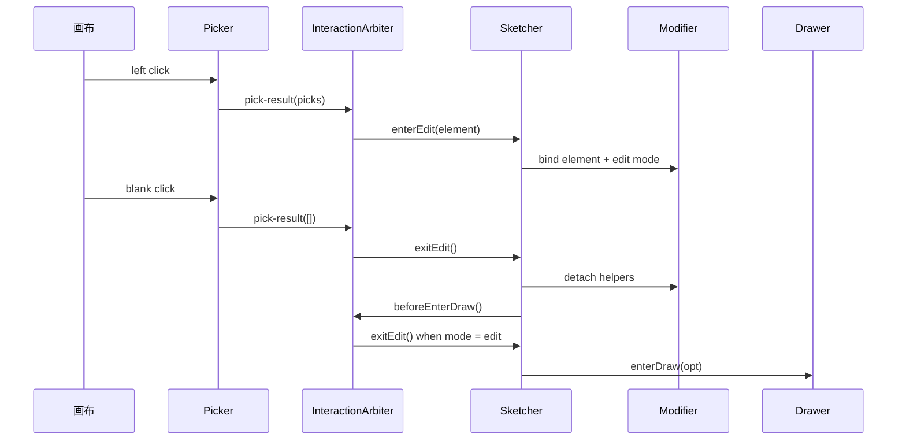

# Sketcher 架构

@maanfa/sketcher 是面向 CesiumJS 的几何绘图工具包，采用**外观模式 + 策略模式 + 事件驱动**架构。

设计原则：

- **职责单一**：每个模块可独立替换（接口注入），`ElementStore` 持有真值、渲染器只消费 Element；
- **策略自驱**：绘制 / 编辑策略经注入的上下文自驱渲染，控制器只做路由与装配；
- **开箱即用**：内置默认实现，无需配置即可工作。

## 组件关系

```
ScreenSpaceEvent → MouseEventManager（按优先级链分发）
      ├── StateMachine（idle / draw / edit + 子状态）
      ├── HotkeyManager（ESC / 修饰键）
      ├── CursorManager（游标优先级调度）
      ├── Drawer ─→ DrawContext ─→ DrawStrategies ─ DrawVertexHelper
      ├── Modifier ─→ EditContext ─→ EditStrategies ─ EditVertexHelper
      ├── HoverManager ─→ Sketcher（反馈合成 → renderer.render）
      ├── Picker ─→ emit 'pick-result'
      ├── InteractionArbiter ─→ 统一协调 Picker / Drawer / Modifier 的模式接管
      ├── ElementStore（真值存储/查询；onMutation → renderer.render）
      └── Sketcher ─ FeedbackStyleStack（hover/select/edit 合成）
                          │
                          ▼
              RendererManager（薄适配层）
                ├─ ElementRendererHub（Element → Primitive，渲染器常驻）
                ├─ PrimitiveContainer（point / ground / label 按 key 去重）
                ├─ DrawRenderChannel（preview / draft / vertices / labels）
                └─ EditRenderChannel（handles / labels / guides）
```

事件链优先级：**idle** → Picker + HoverManager；**draw** → Drawer 独占；**edit** → Modifier 高优 + Picker 回退（编辑态不启用元素 Hover）。

## 交互仲裁与互斥约束

`Picker` 只报告画布点击结果，是否进入编辑由 `InteractionArbiter` 按 `Sketcher.interaction` 策略决定：

- `enablePickToEdit`：空闲态点击已渲染 Element 后进入编辑；
- `enableBlankClickExitEdit`：编辑态点击空白处退出编辑；
- `enableAutoEdit`：绘制完成后默认进入编辑，单次 `DrawOption.autoEdit` 优先级更高。

编辑与绘制是不可配置的互斥关系。`Sketcher.enterDraw()` 在创建 Drawer 会话前固定调用 `exitEdit()`，确保编辑辅助图形、编辑反馈样式、相机输入状态均已清理。



## 数据流

### 绘制

```
enterDraw(opt)
  → Drawer：取常驻渲染器（不 new）→ 创建 DrawContext → 创建策略 → 注册十字标
  → StateMachine.transition('draw')

leftDown / mouseMove
  → 策略 pick(pos) → 更新 placed / cursor → syncRender：
      · 已放置 ≥ 最小顶点数 → renderDraftElement（polygon ≥ 3 草稿含游标，mousemove 销毁重建）
      · 子最小态 → renderPreview（草稿覆盖游标后不再预览）
      · vertexHelpers.sync(placed, { type, cursor })（polygon 含闭合边标签）

leftUp / rightUp / dblClick
  → strategy.canFinish() → Drawer.commitElement()
    → 创建 Element → 入库 → renderer.render → clearDraft → 释放十字标 → emit 'draw-finish'
```

### 编辑

```
enterEdit(element)
  → Modifier：取常驻渲染器 → 创建 EditContext + EditVertexHelper → 创建策略 → helper.bind

leftDown → helper.onLeftDown(screen)（命中并选中可交互辅助元素）→ sub = dragging / inserting
mouseMove → dragResolver.resolve → helper.onMouseMove → EditMotion → validate
         → setVertex / insertVertex → renderElement → helper.sync
leftUp → helper.onLeftUp() → sub = ready
rightUp / ESC → cancelCurrentDrag → 还原坐标 → renderElement → helper.sync
```

### 反馈样式与 ESC

```
hover / select / edit → FeedbackStyleStack.apply/clear → 合成有效样式 → renderer.render(element, style)

ESC → StateMachine.cancel()
  ├─ Draw.Drawing → cancelLast（回退最后一点）
  ├─ Draw.Ready   → 退出绘制
  ├─ Edit.Dragging/Inserting → cancelCurrentDrag（还原拖拽前坐标）
  └─ Edit.Ready   → 退出编辑
```

## 模式控制器激活矩阵

| Mode | SubState | Draw | Edit | Hover | Picker |
|---|---|---|---|---|---|
| Idle | — | ❌ | ❌ | ✅ | ✅ |
| Draw | Ready / Drawing | ✅ 独占 | ❌ | ❌ | ❌ |
| Edit | Ready | ❌ | ✅ 高优 | ❌ | ✅ 回退 |
| Edit | Dragging / Inserting | ❌ | ✅ 独占 | ❌ | ❌ |

## 职责边界

- **ElementStore**：真值存储与查询（增删改查、`findById` / `count` / `bounds`），变更经 `onMutation` 派发。
- **RendererManager**：只做 Element → Primitive 与 draw / edit 临时通道；内置渲染器常驻，`get(type)` 取引用。
- **FeedbackStyleStack**：外观层持有，合成 hover / select / edit 有效样式后传入，renderer 不感知反馈层级。
- **辅助元素**：`VertexElement` / `MidpointElement` / `DistanceLabel` 通用类，交互由字段控制；
  绘制期 interactive=false，编辑期 interactive=true。
- **CursorManager**：优先级调度；绘制十字标（80）、编辑手柄 grab / 拖拽 grabbing（90）、悬停 pointer（50）。

## 扩展点

| 扩展点 | 类型 | 注入方式 |
|---|---|---|
| ElementStore | `IElementStore` | 构造时注入 |
| RendererManager | `IRendererManager` | 构造时注入 |
| DrawStrategy / EditStrategy | `IDrawStrategy` / `IEditStrategy` | 策略工厂（注入 Draw/EditContext） |
| 元素渲染器 | `IElementRenderer` | `ElementRendererHub.register(type, renderer)` |
| 拖拽约束 | `IDragConstraintResolver` | `Modifier.dragResolver` |
| 视觉引导 | `IEditVisualGuideProvider` | `Modifier.guideProvider` |
| 控制器 / 输入链 | `IController` / `InteractionHandler` | `MouseEventManager.configure()` |
| 编辑子状态 | `StateMachine<TEditSub>` | 泛型扩展 |
| 悬停 / 游标 | `Sketcher` setter | `hoverEnabled` / `cursorOverride` |
