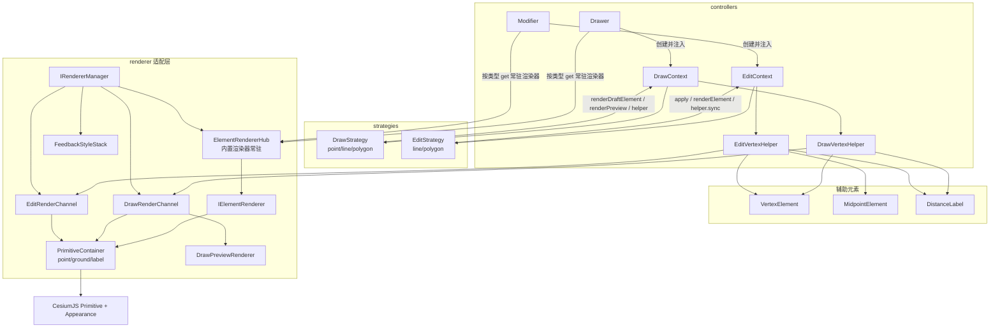

# Renderer 适配层重构设计（已落地）

> 状态：已按本文落地。本文记录最终实现形态与关键决策，供后续维护参考；代码以 `packages/sketcher` 为准。

## 1. 一句话总结

把 `IRendererManager` 收敛为 **CesiumJS Primitive + Appearance 薄适配层**：

- 正式元素经 `ElementRendererHub` 产出 Primitive，内置类型级渲染器**常驻内存**，按类型取引用；
- 绘制 / 编辑期临时渲染走固定 key 通道（见 §6），内容不进 `ElementStore`；
- 渲染由 **Strategy 自驱**：经注入的 `DrawContext` / `EditContext` 渲染，`Drawer` / `Modifier` 只做路由与装配；
- 存储与查询归 `ElementStore`，反馈样式由外观层 `FeedbackStyleStack` 合成后传入；
- 辅助元素通用化（`VertexElement` / `MidpointElement` / `DistanceLabel`），绘制 / 编辑共用，交互能力由字段标明。

## 2. 关键决策

1. **职责边界**：`ElementStore` 持有真值（增删改查、`findById` / `count` / `bounds`）；渲染器只做 `render(element)` / `remove(id)`；反馈样式由外观层合成。
2. **渲染自驱**：策略持有 `DrawContext` / `EditContext`，自行决定 `renderDraftElement` / `renderPreview` / `helper.sync` 的调用，容器不再中转渲染细节。
3. **渲染器常驻**：`ElementRendererHub` 构造时创建内置渲染器一次，`enterDraw` / `enterEdit` 只 `get(type)` 取引用；每次会话新建的是 Strategy 与辅助元素。
4. **命名统一**：内置唯一实现去 `Default` 前缀（`RendererManager` / `ElementStore` / `DrawContext` / `EditContext`），管理器用短角色名（`DrawVertexHelper` / `EditVertexHelper`），辅助元素按 skill 命名。
5. **样式定制**：外观定制走 `ElementStyle`；`register(type, renderer)` 是唯一扩展口，仅新增元素类型 / 自定义原语时使用。
6. **辅助元素通用**：同一套类绘制 / 编辑共用，`interactive` / `hoverable` / `selectable` 决定是否参与交互；绘制期全 false，编辑期全 true。
7. **polygon 草稿含游标**：已放置 ≥ 3 点后，草稿为 `Polygon(placed + cursor)`，mousemove 时**销毁重建**、整面实时跟随；无游标时 `Polygon(placed)`。polyline 草稿只含已放置点，橡皮筋走预览通道。
8. **距离标签**：绘制期显示已放置边 + 活动边；polygon 无游标时含闭合边（last → first），有游标时替换为活动边 + 临时闭合边（cursor → first）。
9. **绘制游标**：`Drawer` 进入绘制时经 `CursorManager` 注册十字标（优先级 80），提交 / 退出释放回默认；编辑期手柄 `grab` / 拖拽 `grabbing`（优先级 90）。

## 3. 架构



依赖方向（硬约束）：`controllers → strategies → renderer → cesium`。策略只依赖
`DrawContext` / `EditContext` 接口，`pick` / `project` 由上下文注入，不直接触碰 viewer / cesium。

## 4. 命名统一

| 角色 | 命名 | 说明 |
|---|---|---|
| 元素类型 | `ElementType` | `'marker' \| 'polyline' \| 'polygon'` 统一字面量 |
| 渲染门面 | `IRendererManager` / `RendererManager` | 薄适配层，仅 `render` / `remove` 原语 + 临时通道 |
| 元素仓库 | `IElementStore` / `ElementStore` | 存储与查询（增删改查、`findById` / `count` / `bounds`） |
| 渲染注册表 | `ElementRendererHub` | 内置渲染器常驻，`get(type)` 取引用 |
| 原语容器 | `PrimitiveContainer` | point / ground / label 三类 host，按 key 去重 |
| 反馈样式栈 | `FeedbackStyleStack` | 外观层持有，纯样式合成、无 cesium 依赖 |
| 绘制通道 | `DrawRenderChannel` | preview / draft / vertices / labels 四 key |
| 编辑通道 | `EditRenderChannel` | handles / labels / guides 三 key |
| 绘制上下文 | `IDrawContext` / `DrawContext` | draw strategy 的唯一渲染入口 |
| 编辑上下文 | `IEditContext` / `EditContext` | edit strategy 的渲染 / 辅助入口 |
| 绘制辅助管理 | `DrawVertexHelper` | 绘制期辅助元素（interactive=false） |
| 编辑辅助管理 | `EditVertexHelper` | 编辑期辅助元素（interactive=true，事件透传） |
| 辅助元素 | `VertexElement` / `MidpointElement` / `DistanceLabel` | 通用类，交互由 `InteractionFlags` 控制 |
| 运动量 | `EditMotion` | 可辨识联合（vertex / midpoint），skill §5 |
| 手柄编号 | `HandleId` | `{ kind: 'vertex' \| 'midpoint'; index }` |
| 绘制预览构建 | `DrawPreviewRenderer` | 坐标结构 → `RenderedItem[]`，纯构建不挂载 |

> 只对**类**去 `Default` 前缀；`constants.ts` 中的 `DefaultPreview` / `DefaultMarker` 等是默认值常量，保留原名。

## 5. 生命周期

### 渲染器常驻

内置渲染器是**无状态适配器**（只读 `ElementRendererContext` + 纯构建函数），在 `ElementRendererHub`
构造时创建一次并常驻：

```ts
for (const type of ['marker', 'polyline', 'polygon'] as const) {
  this.register(type, ElementRendererFactory.create(type, ctx))
}
```

- `Drawer.enterDraw` / `Modifier.enterEdit` 只调用 `elementRenderer.get(type)` 取引用，从不 new 渲染器；
- 每次会话新建的是 **Strategy、DrawContext / EditContext、辅助管理器**（携带 placed、手柄等会话状态），退出销毁；
- 外观定制走 `ElementStyle`；新增元素类型 / 自定义原语时才用 `register(type, renderer)` 扩展。

### 辅助元素生命周期

进入绘制 / 编辑时创建、退出销毁，**不进 ElementStore、不参与业务状态**（skill 轻量原则）。
绘制期以 `{ interactive: false }` 构建（仅展示），编辑期以 `{ interactive: true, hoverable: true, selectable: true }` 构建。

## 6. 通道 key 与生命周期

```ts
const DRAW_CHANNEL_KEYS = { preview: 'draw:preview', draft: 'draw:draft', vertices: 'draw:vertices', labels: 'draw:labels' }
const EDIT_CHANNEL_KEYS = { handles: 'edit:handles', labels: 'edit:labels', guides: 'edit:guides' }
const DRAFT_ELEMENT_ID = '__draft__'   // 草稿元素统一临时 id，不进 ElementStore
```

| key | 内容 | 创建 | 清理 |
|---|---|---|---|
| `draw:preview` | 橡皮筋 / 幽灵点 / 临时面 | 每次 mousemove / leftDown 经策略刷新 | 无活动边时 `clearPreview()`；退出绘制 `clearDraft()` |
| `draw:draft` | 草稿体（真身 Element 经适配器产物） | 顶点数达最小后每次刷新 | `clearDraftElement()`；提交 / 退出 |
| `draw:vertices` | 绘制期顶点标记 | 每次 `vertexHelpers.sync()` | `clearVertices()`；提交 / 退出 |
| `draw:labels` | 绘制期距离标签 | 每次 `vertexHelpers.sync()` | `clearLabels()`；提交 / 退出 |
| `edit:handles` | 编辑手柄（顶点 + 中点） | `EditVertexHelper.sync()` | `clearHandles()`；退出编辑 |
| `edit:labels` | 编辑期距离标签 | `EditVertexHelper.sync()` | `clearLabels()`；退出编辑 |
| `edit:guides` | 编辑引导线 | Modifier 刷新 | 退出编辑 |
| 元素 id | 正式元素原语 | `render(element)` | `remove(id)` / `clear` |

## 7. 核心接口

### 7.1 `IRendererManager`

三件事：`render(element, style?)`（按元素 id 去重产出 Primitive）、`remove(id)`、
`replaceElementItems(id, items)`（低层替换，供按需渲染），外加 `draw` / `edit` 临时通道与生命周期（`clear` / `destroy`）。
不提供元素增删改与反馈簿记。

### 7.2 `DrawRenderChannel`

`renderPreview(info)` / `clearPreview()`、`renderDraft(items)` / `clearDraftElement()`、
`renderVertices(coords, style?)` / `clearVertices()`、`renderLabels(labels, style?)` / `clearLabels()`、`clear()`。
预览信息 `DrawPreviewInfo`：`{ type, coords, style? }`，子最小态传全结构，草稿态只传活动边 / 临时闭合。

### 7.3 `EditRenderChannel`

`renderHandles(handles, hoveredIdx, activeIdx, style?)` / `clearHandles()`、
`renderLabels(labels, style?)` / `clearLabels()`、`renderGuides(guides)` / `clearGuides()`。

### 7.4 `IDrawContext` / `DrawContext`

策略的唯一渲染入口：`elementRenderer`（按类型注入的常驻适配器）、`vertexHelpers`、
`renderPreview` / `clearPreview`、`renderDraftElement(element, style?)` / `clearDraftElement`、
`clearDraft()`（一键清理预览 + 草稿 + 顶点 + 标签）、`pick(pos)`。

### 7.5 `IEditContext` / `EditContext`

`elementRenderer`、`helper`（`EditVertexHelper`）、`renderElement(element, style?)`（走 `manager.render`，
默认用外观层注入的反馈合成样式）、`renderElementWith(element, style?)`（低层 `replaceElementItems`）。

### 7.6 辅助元素模型

```ts
interface InteractionFlags {
  interactive: boolean      // 是否参与交互（命中 / 选中 / 拖拽）
  hoverable?: boolean
  selectable?: boolean
}

interface IAuxElement {          // 统一契约：attach / sync / detach + 交互字段
  readonly id: string
  interactive: boolean
  hoverable: boolean
  selectable: boolean
  attach(element: Element): void
  sync(element: Element): void
  detach(): void
}

interface IAuxHandle extends IAuxElement {   // interactive=true 时启用
  readonly id: HandleId
  hitTest(screen: Cartesian2, tolerance: number): boolean
  onHover?(entered: boolean): void
  onSelect?(selected: boolean): void
  onDrag?(motion: EditMotion): void
}
```

| 类 | 绘制期 | 编辑期 | 位置计算 |
|---|---|---|---|
| `VertexElement` | 落点标记（不可交互） | 可拖拽顶点手柄 | `element.getVertex(index)` |
| `MidpointElement` | — | 可拖拽中点（插入顶点） | 边中点，polygon 末边回绕到 0 |
| `DistanceLabel` | 边长标签（interactive 恒 false） | 边长标签 | 边中点，文本 `formatDistance(distance)` |

运动量 `EditMotion`（可辨识联合）与 `HandleId` 与 skill `editing-helpers.md` 一致；辅助元素向上发射运动量，
Modifier 透传鼠标事件（`onLeftDown` / `onMouseMove` / `onLeftUp` / `hover`）并命中选中可交互元素。

### 7.7 `FeedbackStyleStack`

外观层持有，按 `hover` / `select` / `edit` 三层簿记（视觉优先级 edit > select > hover），
`apply` / `clear` / `clearEntry` / `effective(base, id)` 合成有效样式，纯数据无 cesium 依赖。

### 7.8 `ElementStore` 扩展

在既有增删改查基础上新增：`findById(id)`（`get` 别名）、`count()`（O(1) 缓存计数）、
`bounds()`（WGS84 包围盒，缓存随增删 / 突变失效重算，空仓返回 null）。

```ts
interface Bounds {
  west: number; south: number; east: number; north: number
  minHeight: number; maxHeight: number
}
```

## 8. 渲染规则

### 8.1 绘制

| 类型 | 最小顶点数 | renderPreview | renderDraftElement | 距离标签 |
|---|---|---|---|---|
| marker | 1（点击即提交） | 幽灵点 `[cursor]` | 无草稿体，leftUp 直接提交 | 无 |
| polyline | 2 | `[p0, cursor]` 橡皮筋段 | `Line(placed)`，预览画 `[pLast, cursor]` 活动边 | 已放置边 n-1 条 + 活动边 |
| polygon | 3 | 子最小态 `[p0, cursor]` / `[pLast, cursor, p0]`；≥3 草稿覆盖游标后不再预览 | `Polygon(placed + cursor)` 实心实体，mousemove 销毁重建（无游标时 `Polygon(placed)`） | 已放置边 n-1 条；无游标时闭合边（last → first）；有游标时活动边 + 临时闭合边（cursor → first） |

绘制事件流：`leftDown / mouseMove → 策略 pick → 更新 placed / cursor → syncRender`
（渲染草稿 → 渲染预览 → `vertexHelpers.sync`）→ 返回子状态。提交时 Drawer 创建正式元素 → 入库 →
`rendererManager.render` → `clearDraft`。

### 8.2 编辑

辅助量同步规则：

| 辅助量 | 重算方式 |
|---|---|
| 顶点 | `element.getVertex(i)` |
| 中点 | 边中点：line `i→i+1`；polygon 含末边回绕 `n-1→0` |
| 距离标签 | `formatDistance(distance(a, b))`，锚点取边中点，范围同中点集合 |

事件链：Modifier 透传鼠标事件 → helper 命中并选中可交互辅助元素 → 生成 `EditMotion` →
`EditStrategy.validate` → 应用变更（`setVertex` / `insertVertex`）→ `renderElement` → `helper.sync`。

### 8.3 反馈样式

`hover / select / edit` 由外观层 `FeedbackStyleStack.apply / clear` 合成有效样式，
经 `renderer.render(element, style)` 传入，renderer 不感知反馈层级。

## 9. 职责边界

- **ElementStore**：元素真值存储与查询，变更经 `onMutation` 派发。
- **RendererManager**：只做 Element → Primitive 与 draw / edit 临时通道，不做存储与反馈簿记。
- **FeedbackStyleStack**：外观层持有，合成反馈样式。
- **辅助元素**：通用类 + 交互字段，不进 ElementStore；绘制 / 编辑各自管理器创建与回收。
- **CursorManager**：优先级调度；Drawer 十字标（80）、编辑手柄 grab / 拖拽 grabbing（90）、悬停 pointer（50）。

## 10. 测试与验证

核心单测覆盖：`ElementRendererHub`（常驻）、`DrawRenderChannel`（四 key 去重）、`DrawPreviewRenderer`、
`DrawContext`、`DrawVertexHelper`（闭合边 / 临时闭合边标签）、辅助元素（交互字段与命中）、
`EditVertexHelper`（事件透传与数量）、绘制 / 编辑策略（调用序列与销毁重建）、`Drawer`（渲染器注入、
十字标注册释放）、`Modifier`（拖拽链）、`ElementStore`（findById / count / bounds）与反馈回归。

验证命令：`pnpm typecheck`、`pnpm vitest run`、`pnpm lint`、`pnpm --filter @maanfa/sketcher build`；
`apps/dev-workshop` 手测点 / 线 / 面绘制与编辑闭环。
